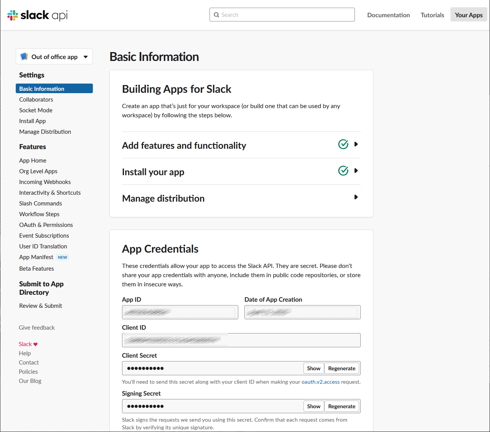

# Out-of-office-slackapp-bot

> Bot for slack that manages Out of office from users.

---

## Table of Contents

- [Description](#description)
- [Installation](#how-to-get-started)
- [How to start developing](#how-to-start-developing-slack-bot-with-java)

---

## Description

*Out of office slack bot app is small app that manages users out of office time.*

---

## Technologies

- Bolt framework for Java
- Spring boot
- Ngrok

[Back To The Top](#out-of-office-slackapp-bot)

---

# How to get started
1. Set your env vars in run configuration
- (In the Intellij you go to Run > Edit Configurations > Environment Variables there you need to enter 
```java
SLACK_BOT_TOKEN=xoxb-XYZ;SLACK_SIGNING_SECRET=XYZ;
```
- SLACK_BOT_TOKEN - The valid bot token value starting with xoxb- in your development workspace.
- You can find it in OAuth & Permissions on the following page: 
- SLACK_SIGNING_SECRET - The secret value shared only with the Slack Platform.
- It is used for verifying incoming requests from Slack.
- Request verification is crucial for security as Slack apps have internet-facing endpoints.
- You can find it in Basic information > App Credentials > Signing Secret on the following page: 
2. Install and Setup [ngrok](https://ngrok.com/ "Ngrok link")
3. Turn on ngrok using command ngrok:
`ngrok http 3000`
4. Copy ngrok address e.g. https://123456.ngrok.io to slash commands on following page: 
 - You will need to edit each command by clicking on small pencil icon to edit command and on Request URL you will replace the existing link with new link from above following with /slack/events 
 - e.g. https://123456.ngrok.io/slack/events 
 - 
5. Now try to start the app and try some commands to see if everything is working. Hopefully after everything is working you are ready and happy developing :smile:
 - If you will have some problems and need some more details containing how to setup all you can check for more information on next [link](https://slack.dev/java-slack-sdk/guides/getting-started-with-bolt "Bolt getting started sdk information link").

[Back To The Top](#out-of-office-slackapp-bot)

---

# How to start developing Slack Bot with Java
1. For all details on Slack SDK for Java you can check for it on next [link](https://slack.dev/java-slack-sdk/guides/bolt-basics "Bolt basics information link").
2. But for main explanation SlackAppController exposed endpoint /slack/events and SlackApp class controls all commands. Commands are then consumed in handlers package (each handler is for each command you have kinda test method /hello to test it out how it is interlinked for simplicity)
3. After each handler there is each handler's CommandServiceImp that has methods for each command handler. And in the end there is MessageServiceImp that handles all messages.

[Back To The Top](#out-of-office-slackapp-bot)

---

